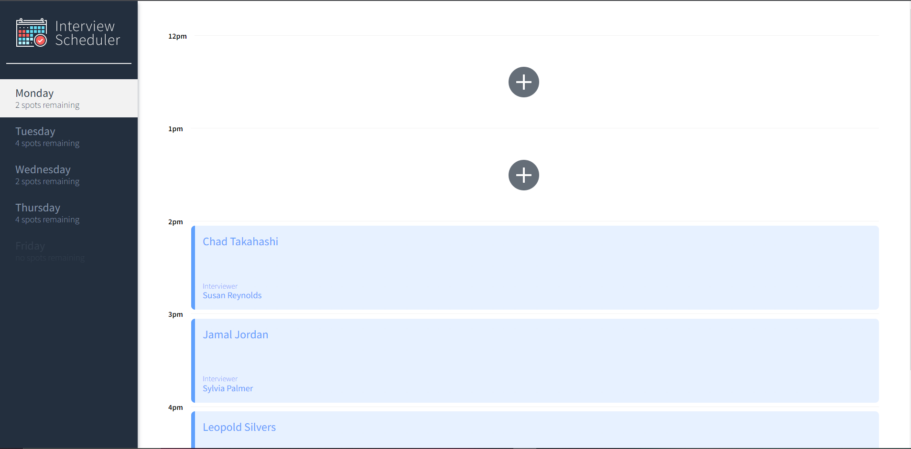
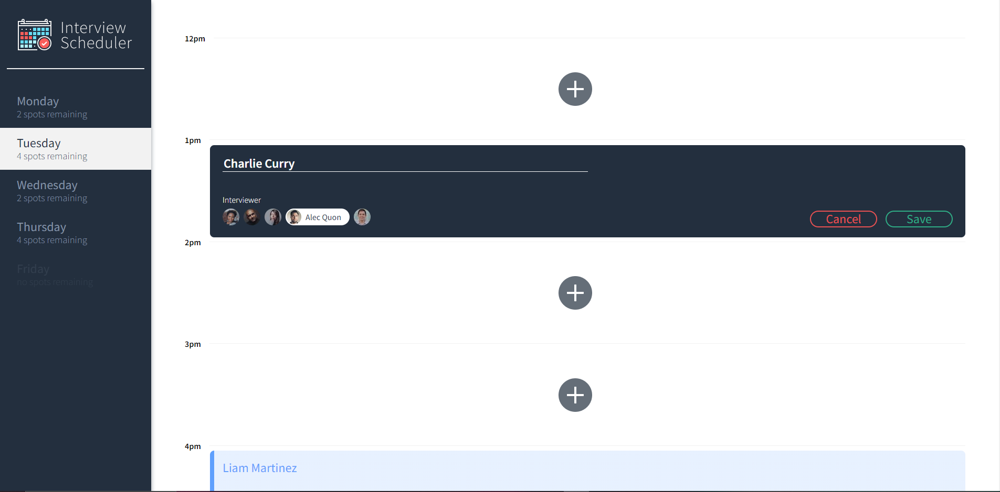

# Interview Scheduler

Interview Scheduler is an app that can be used to manage appointments for interviews!

Hourly interviews can be scheduled for any interviewer that is available for each day in the week.

Users are able to create, cancel, delete and edit appointments with ease with a clean UI.


## Screenshots




## Setup

Install dependencies with `npm install`.

## Running Webpack Development Server

```sh
npm start
```

## Running Jest Test Framework

```sh
npm test
```

## Running Storybook Visual Testbed

```sh
npm run storybook
```
